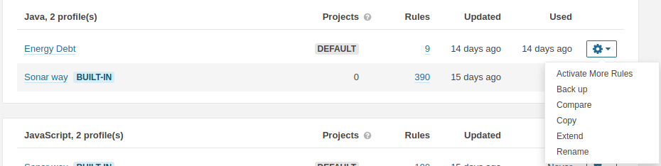
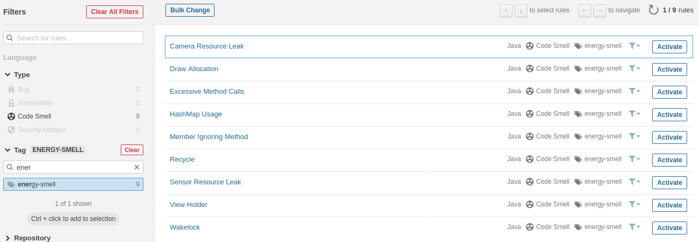
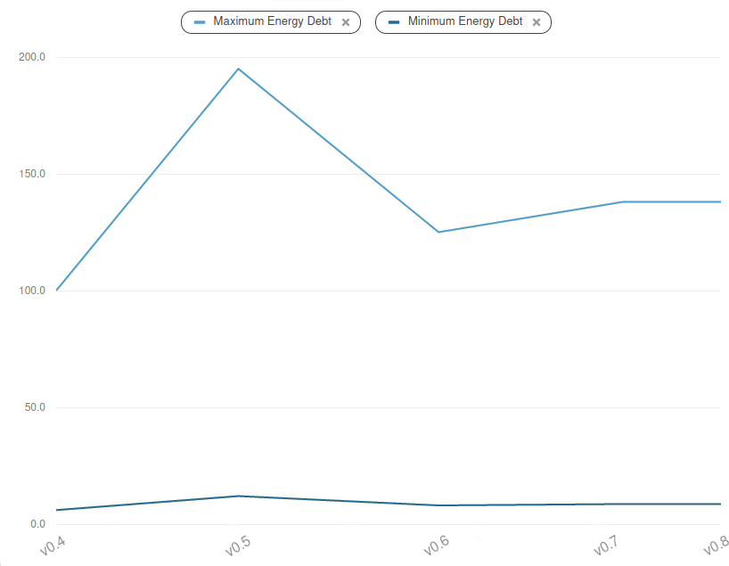

# E-Debitum-tool

This guide instructs on the installation and usage of the E-Debitum tool in SonarQube 8.x

## Installation

The tool is composed of two separate plugins, which need to be built.

To build the rules plugin, open the `energy-debt-rules` directory and input the command `mvn clean install`.

To build the metrics plugin, open the `energy-debt-metrics` directory and input the command `mvn clean package`

Once the plugins have been built, installing them is as simple as moving the jar files in the resulting `target` fto your SonarQube's `$SONAR_HOME/extensions/plugins/` folder and (re)starting SonarQube.

## Usage

Once installed, you will need to activate the Energy Debt rules in your Java Quality Profile (if using the default Sonar Way profile, you will need to extend it into a new profile) through an administrative account.

This will bring up the list of Java rules which can be activated. You can easily find the Energy Debt Rules by filtering the `energy-smell` tag. Once found, all rules can be activated by selecting `Bulk Change` and choosing `Activate In [Quality Profile name]`.

Once this is complete, executing a Java code analysis will yield its Energy Debt. This can be viewed by accessing the project page, opening its Activity tab and generating a Custom graph, selecting the metrics `Maximum Energy Debt` and `Maximum Energy Debt`. The results will be displayed as a value of miliJoules per minute.

